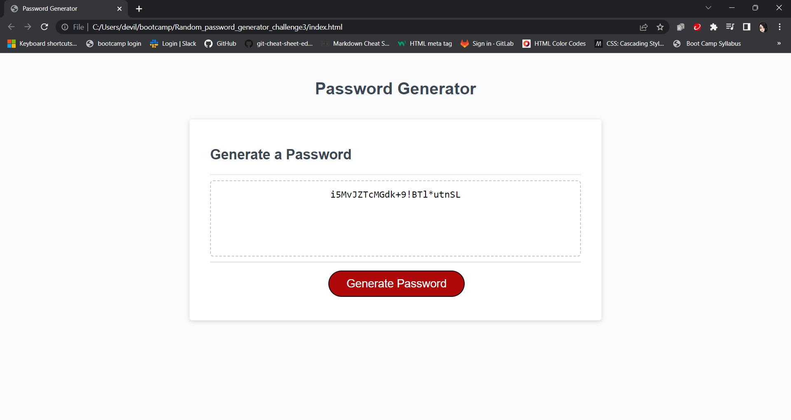

# Random_password_generator_challenge3

## Description

Challenge 3 is to add Javascript to make a random password generator work. We were tasked with adding the generate password code, the parts that make it work in a clean fashion (the event listener part I'm guessing) was provided for us.

When a user clicks the button, they will be given a unique, randomly generated password based on selections they provide.

I learnt a lot over the course of working on this assignment. Being the first time we worked with Javascript, there was many growing pains in training my brain to understand what the computer wants inputted as code to do what I want it.

I had to do much googling and documentation reading this time around to solve this. I also implemented pseudo-coding much more into this challenge, just writing out basic phrases like "if user picks lowercase, then i want to add it to the password options" to figure out a way to write that section of my code to work.

I am extremely proud of myself for really figuring this one out!

## Installation

N/A

## Usage

To use the password generator, user clicks the button that Generate Password button. The a series of prompts will appear asking for user to select desired length of password along with what types of characters (lowercase, uppercase, numbers or special symbols) they would like to use. If user chooses a length less than 8 or over 128 characters, or does not choose at least 1 type of character, an alert will pop up informing them of this, and they will have to re-click button to start over again.

Once all criteria has been meet, a randomly created password will be displayed for the user based on their selections.



https://github.com/octofoxx/Random_password_generator_challenge3
    ```

## Credits

https://developer.mozilla.org/en-US/docs/Web/JavaScript/Reference/Global_Objects/String/charAt - Used the info here to learn about charAt, which is what I used to make my Random.math work to pick letters and symbols, because it wouldn't work otherwise. I saw it listed in various examples for how Math.Floor(Math.random) works in real world code, so I read up to see how it worked before implementing it into my code.

## License

N/A